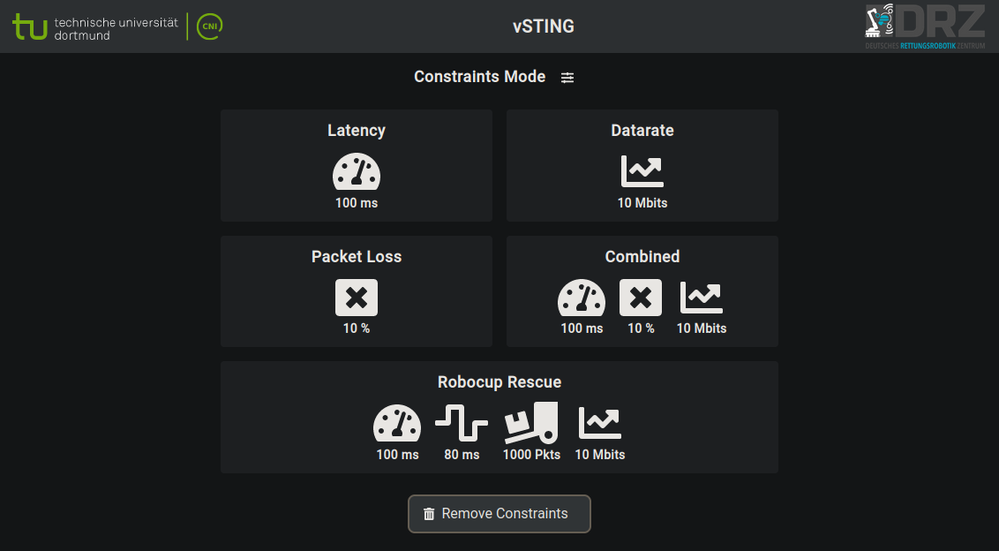

# vSTING-SA (Non-Final)
**virtual Spatially distributed Traffic and INterference Generator - Standalone**

The vSTING is a solution for evaluating teleoperated robots and other network reliant systems or applications in challenging network environments such as ones with heavy traffic or interference. It is adjusted for practical usage and ease of installation for system evaluations and experiments.

***This work has been supported by the German Center for Rescue Robotics (DRZ)
and funded by the German Federal Ministry of Education and Research (BMBF)
in projects A-DRZ (13N14857) and DRZ (13N16476).***

<br/>
<br/>


<br/>
<br/>

# How it works

vSTING uses network emulation to recreate degraded network environments. One main advantage is the lack of additional software installation on the evaluated systems. vSTING runs on a separate device tasked with encapsulating the network degradation.
The vSTING device must be installed between operator and robot to introduce network degradation on the communication link between them. The resulting architechture  is illustrated in the figure below.


<!--  -->

This results in a hardware requirement for the device on which vSTING is installed: it must feature at least two RJ45 ports to be able to support the two ethernet links meant for robot and operator. A third port can be required to stand for the control channel, to connect the device on which the vSTING user interface will be displayed. This link can however be also be realized in other ways, such as over WiFi or by installing vSTING on a device with display and input devices.


# Installation

As mentionned previously, vSTING is a software solution running on adequately configured hardware. Two installation methods are supported:

- **installation on a supported device using system image**: This is the recommended installation method, since it requires less configuration steps. A system image is downloaded and installed on the device. After this, the vSTING is ready.

- **installation on custom devices**: This method requires additional configuration steps on your device and on the downloaded software bundle.


## Install on a supported device

the software bundle was preconfigured and tested on some devices and system images ready to be used were created. The following indications were tested and are therefore supported for the following system:  

- [APU-4D4](https://www.apu-board.de/produkte/apu4d4.html)

The following materials are required for this tutorial:  

1. One mirco SD-card (at least class 10 and 16GB) with a micro-SD adapter  
2. One personal computer with ubuntu 20.04 to download and install the system image on the SD-card  
3. One APU 4D4  


<!--  -->

The following instructions will guide you through the download of the vsting system image and its installation on your APU 4D4 to turn it in a vSTING device.

Starting on the personal computer:

- Install packages required for the setup process:

        sudo apt install -y coreutils pv wget gzip git

- Clone the vsting repository:

        git clone https://github.com/tudo-cni/vsting-sa.git

- Enter the scripts folder found in the cloned folder, make the scripts executable and download the system image by running the download script:

        (cd vSTING-SA/scripts && chmod +x *.sh && ./download-image-apu4d4.sh)

  **NB**: *The image file's size is around 1.5GB, make sure you have enough free space on your system, and that you are not using a metered internet connection. The download may take more or less time depending on your internet speed.*

- Insert the SD-card in the personal computer and make sure it is available. If it is, you should be able to find the sdcard device file in the `dev` folder. It usually starts  with either `mmcblk` or `sd`. you can also open the `disks` application and look for the sd-card device file as illustrated in Fig. \ref{fig:find-sd-card-device}  below:  


- Install the vsting image on the sdcard by running the image installation script `install-image-apu4d4.sh` with your *sdcard device file* and the *downloaded image file's name* as arguments. This step can take a while.  
As an example, provided the sdcard device is `mmcblk0` and the image file is named `apu-vsting-sa.img.gz`, the command to run in your terminal would look like this: 

        ./install-image-apu4d4.sh /dev/mmcblk0 apu-vsting-sa.img.gz
  **NB**: *when calling the script with the arguments, the sdcard device comes first and the image file comes second. Misplacing the arguments could corrupt the image file. In this case, a new download is required.*

After the image is written to the SD-card, eject it from the computer:

- Insert the SD-card in the APU 4D4 and power it up.

- Connect your computer using an ethernet cable to the APU on the ethernet port `enp1s0` (the first one from the right while the APU is upside down, the closest one the  serial port and farthest from the USB ports). Fig.\ref{fig:apu-ports-annotated} below shows the annotated network ports of the APU 4D4.


- Give your computer the fixed ip `10.40.1.10` with network mask `/24` or `255.255.255.0` on the wired network interface. The annotated steps in [the appendix](#set-a-static-ip-address-on-your-device)  might be of help.

- Make sure the connection is effective by trying to reach the APU. The output of the following command should display the round-trip time to the APU:

        ping 10.40.1.1


Once you have ascertained that the connection is effective, you can start using vSTING. to this end:

- Open the following URL in the browser: `http://kn-adrz-vsting.local`. The vSTING  user interface should be visible.

The **installation** of your vSTING device is now **completed**.

**NB**: *When using the vSTING to induce latency, a destination IP must be provided to measure the round trip time towards that destination. The perform these measurements, the vSTING needs an IP address as well. In case you are using vSTING  in a network without automatic assignment of IP adresses (i.e DHCP), you must further configure the vSTING to assign it an address in the valid network range. How to do this is explained in the usage section.*

## Install on Personal Computer

It is possible to install the vSTING software on another device, such as a personal computer. However the requirement of 2 network ports must be met. USB to Ethernet Adapter can be used to provide an additional network port, as personal computers usually have only one network port.

The materials required for installing vSTING on a personal computer are as follows:

- one personal computer with **x86-64 CPU** and **Ubuntu 18.04 or 20.04** installed with at least one ethernet port. later Ubuntu releases might eventually work, but have not been tested at this point in time.
- eventually, one USB to ethernet adapter, in case the personal computer features only one ethernet port.


The steps to install vSTING on your personal computer are as follows:
- Install packages required for the installation process:

        sudo apt install -y coreutils sed wget git python3 iptables-persistent network-manager

- Install docker and docker-compose by following this [tutorial](https://docs.docker.com/engine/install/ubuntu/#install-using-the-repository). If you already have docker installed you can skip this step, but make sure the version requirements specified below are met.

  **NB**: *Don't forget to add your user to the docker group with following command*

        sudo usermod -aG docker $USER

  *Make sure you have at least docker-compose `v1.25.5` installed and that the docker-compose executable can be reached at `/usr/local/bin/docker-compose`.
  If your docker-compose is located else where you can simply add a symbolic link at the expected location as follows:*

        sudo ln -s <docker-compose_executable_path> /usr/local/bin/docker-compose

- Clone the vsting repository:

        git clone https://github.com/tudo-cni/vsting-sa.git

- Enter the scripts folder found in the cloned folder, make the scripts executable and download the vsting release by running the download script:

        (cd vsting-sa/scripts && chmod +x *.sh && ./download-release.sh)
- vSTING requires two network interfaces. The network interfaces connected to the ethernet ports of your computer must be identified. To list the network interfaces present on your system use:

        ls /sys/class/net

- The identified network interfaces must be made available. use the network manager to identy network connections which might be using these interfaces with the following:

        nmcli connection 

  Look up the network interfaces' names in the `DEVICE` column to find out which connections are using them.

- Disable the connections using the network interfaces:

        sudo nmcli connection down <connection-name>

- Enter the release folder and configure it for your machine by running the configuration script (setup-custom-device.sh). For the configuration of vSTING, you need to specify the two network interfaces which were identified and secured previously. The configuration script will create a network bridge to connect the robot and the operator together through these network interfaces and add the interface names in the configuration files of the vSTING submodules.  
  Therefore, the names of the network interfaces must be provided as arguments to the configuration script like in the example below. 

  ***NB**: In the snippet below `enp4s0` and `enp3s0` are just examples. make sure to replace them with the names of the network interfaces present on your computer. Also, the network interface connected to the robot must come first, and then the one connected to the operator.*

        (cd vsting-sa/scripts && ./setup-custom-device.sh enp4s0 enp3s0)

- After the configuration, make sure that the network bridge is activated by checking the active connections once more:

        nmcli connection


  The following connections should be active: vsting-bridge, vsting-br-operator, vsting-br-robot. If not, activate them manually with:

        nmcli connection up vsting-bridge vsting-br-operator vsting-br-robot

- Now that the hardware is configured and the software release as well, install the release on your system by running the install script:

        (cd ~/vsting && ./install.sh)

- vSTING can now be started with the following command:

        (cd ~/vsting && ./vsting.sh start)

  Once it is started you should be able to see the user interface by opening the following URL in your browser: `http://localhost`.
  This start is only needed after a fresh installation. the vSTING services will automatically run on computer start.

- to stop or restart the vSTING, use:

        (cd ~/vsting && ./vsting.sh stop)
  ***NB**: This only stops the vSTING submodules. but they will be starting again after the next reboot. to stop vSTING in a persistent way, run the uninstall script:*

        (cd ~/vsting && ./vsting.sh stop && ./uninstall.sh)
        

  Furthermore, to use the network ports of your computer normally again, the vsting network bridge must be disabled or deleted. To delete it:

        (cd ~/vsting-sa/scripts && ./delete-vsting-bridge.sh)
# Updates

To update vSTING to the latest, version run the `update.sh` script found in the release folder. The script checks for available newer versions, stops the current version, then proceeds to download and install the latest version. If the vsting services do not startup correctly after the update, the update is rolled back and the previous version is installed back.  
In case your perform the update on a provided system image, the required user password is: `robocupvstingkey`

# Usage

The user interface of vSTING offers a control and monitoring section. In the control section, the network constraints can be defined, enabled and disabled. The monitoring section presents the user with live network metrics the ascertain the effect of the network constraints.

## Control Section
The control section has two variants between which the user can switch freely by clicking on the settings button at the right of the title of the control section. The two variants of the control section will now be presented in more detail.

### Simple Controls
The first variant of the control section, named `simple controls`, provides a simplified way of enabling and disabling network constraints. In this variant, predefined network constraint modes are presented to the user:

- Latency: creates 100 ms additional latency on the network link  
- Datarate: caps the maximal available transfer datarate to 10 MB  
- Packet Loss: induces 10% packet loss  
- Combined: combines all of the above.  

The user can then activate a constraint mode by clicking on it and disable it by either selecting another constraint mode, or by clikcing on the `Remove Constraints` button.



### Expert Controls

The `expert controls` is the second variant of the control section. It offers more control over the strength of the network degradation. Furthermore, the network constraints can be applied either symmetrically (same degradation from and to the robot) or asymmetrically (data packets sent to the robot experience difference degradation than packets sent from the robot).


## Monitoring Section

The monitoring section provides insight over the following performance indicators:

- Incoming traffic: t.b.d.  
- Outgoing traffic: t.b.d.  
- Round trip time (RTT): t.b.d.  
- Packet loss: t.b.d.  


## IP-Address Settings for traffic measurements

t.b.d.

### Set Destination IP

t.b.d.

### Set Source IP (if no DHCP is avaiable)

t.b.d.

# Related Publications
- Manuel Patchou, Janis Tieman, Christian Arendt, Stefan Böcker and Christian Wietfeld, [**Realtime Wireless Network Emulation for Evaluation of Teleoperated Mobile Robots**](https://cni.etit.tu-dortmund.de/storages/cni-etit/r/Research/Publications/2022/Patchou_2022_SSRR/Patchou_SSRR.pdf), In *IEEE Symposium on Safety, Security, and Rescue Robotics (SSRR)*, 2022.


# Acknowledgements

To acknowledge us in your publication(s) please refer to the following publication:

```tex
@InProceedings{Patchou2022a,
	Author = {Manuel Patchou, Janis Tieman, Christian Arendt, Stefan Böcker and Christian Wietfeld},
	Title = {Realtime Wireless Network Emulation for Evaluation of Teleoperated Mobile Robots},
	Booktitle = {2022 IEEE Symposium on Safety, Security, and Rescue Robotics (SSRR)},
	Year = {2022},
	Address = {Sevilla, Spain},
	Month = nov,
	Publisher = {IEEE},
	Doi = {10.1109/SSRR56537.2022.10018773}
}
```
# Appendix

## Set a static IP address on your device


